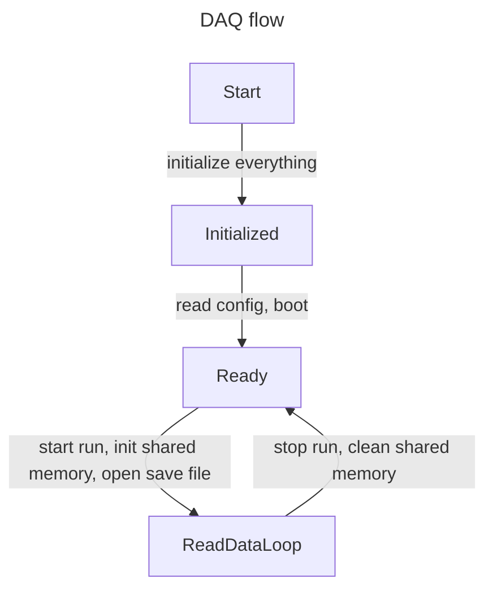
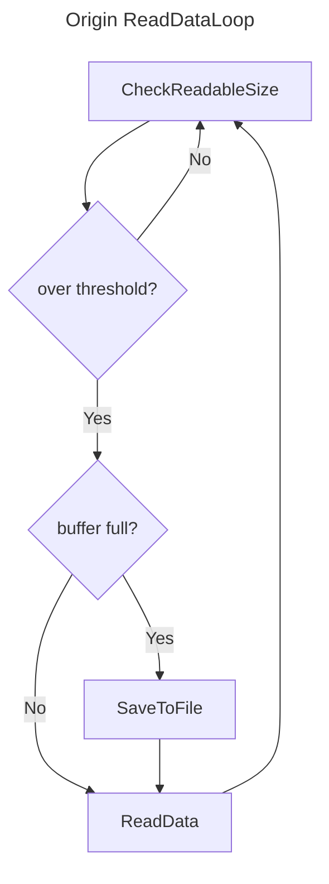
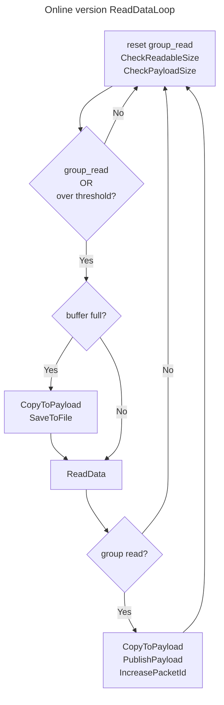

# 获取流程详解

> [!Warning]
>
> 这部分也是随便写的。

## 引入

以后写

## 整体工作流程

共享内存的准备分为两部分

1. 启动程序和 Boot 的时候，初始化变量、读取组编号、读取模块对齐长度
2. 每个 run 开始的时候，申请共享内存、初始化 publisher

因为 publisher 的构造参数依赖于 run 序号，所以每个 run 开始都要初始化 publisher。而在 run 结束的时候，就要重置变量、释放 publisher 的资源。

## 读取数据流程

### 原版的读取数据流程

### 加入共享内存后的读取流程

