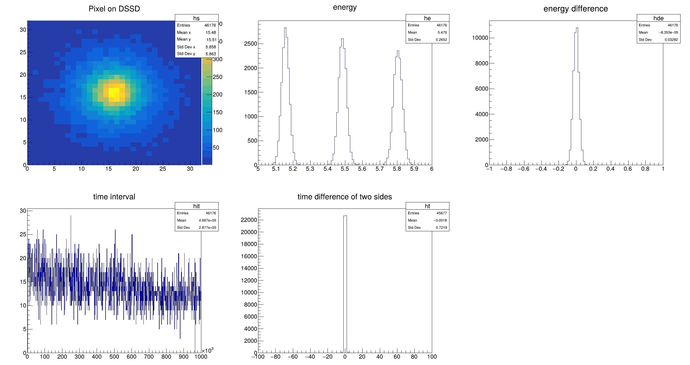

# 简介

本项目是 [PKUXIADAQ](https://github.com/wuhongyi/PKUXIADAQ) 的魔改版本，保留了原来的 UI 界面和对应的功能同时增加了在线（online）功能。在线依赖于[iceoryx](https://iceoryx.io/latest/)提供的共享内存机制，所以程序会实时从内存中读取数据并绘图。鉴于实验设置百花齐放，本项目难以覆盖所有的情形，所以仅提供一个在线分析的框架，数据分析和画图的过程由用户完成。

## 下载和安装

### 依赖

+ iceoryx，2.06
+ cmake，3.10 以上
+ ROOT，6.28 以上
+ [PLXSDK](https://www.broadcom.com/products/pcie-switches-retimers/software-dev-kits)，8.23，

> [!TIP]
>
> 实际除了 iceoryx 和 PLXSDK 的版本以外，cmake 和 ROOT 版本并没有硬性要求，只要能编译能跑就行。PLXSDK 即控制 XIA 硬件的采集卡的驱动，上面提供的是官方版本，也可以在 [PKUXIADAQ](https://github.com/wuhongyi/PKUXIADAQ) 中下载对应的压缩包或者使用 [XIA 提供的版本](https://github.com/xiallc/broadcom_pci_pcie_sdk)，三者是一模一样的。

### iceoryx

参照 iceoryx 的官方文档下载和安装 iceoryx。注意本项目中使用的版本 2.06，所以下载后，需要用 git 命令切换版本

```bash
git checkout v2.0.6
```

然后再进行文档中的编译安装步骤。

### PLXSDK

下载后将 `PlxSdk` 解压到自己喜欢的目录，并将该目录设置为环境变量

```bash
export PLX_SDK_DIR="/path/to/PlxSdk"
```

可以该命令保存到 `~/.bashrc` 。

编译 PlxApi

```bash
# 进入 PLXSDK 的目录
cd ${PLX_SDK_DIR}
# PlxApi 目录
pushd PlxApi
# 清理
make clean
# 编译 PlxApi
make
# 返回
popd
```

测试 PlxApi

```bash
# 进入测试目录
pushd Samples/ApiTest
# 清理
make clean
# 测试
make
# 返回
popd
```

编译驱动

```bash
# 进入驱动目录
pushd Driver
# 编译
bash builddriver 9054
# 返回
popd
```

编译 PLXSDK 的过程遇到问题可以参考[PKUXIADAQ](http://wuhongyi.cn/PKUXIADAQ/zh/INSTALL.html) 的文档。

> [!IMPORTANT]
>
> 如果是从官网下载的 PLXSDK，并且使用的系统是 Ubuntu 20.04 或者 22.04，编译错误时参考 [Ubuntu 编译 PLXSDK](compile_plxsdk_ubuntu.md)。

### 下载

从 github 下载

```bash
git clone https://github.com/kinstaky/xia-daq-gui-online.git .
```

### 编译

打开目录

```bash
cd xia-daq-gui-online
```

cmake 构建，设置源文件为当前目录（.），编译出来的文件放在 build 文件夹。

```bash
cmake -S. -Bbuild
```

用 4 个线程编译

```bash
cmake --build build -- -j4
```

## 开始使用

由于本项目只是一个框架，而且实际使用需要结合 XIA 获取使用，所以并没有实质的包含真实的获取硬件和探测器的在线程序试用。

在接上获取后，可以运行 `./build/bin/gddaq`，会弹出一个和 PKUXIADAQ 一模一样的 UI，按照 PKUXIADAQ 的使用方式使用。

如果仅仅测试在线框架和软件本身，可以参考下一节的示例及测试，里面包含一个模拟的获取系统和对应的在线程序。

如果是要应用该框架到真实的获取和探测器上，详细参考[上手指南](getting_started.md)。

## 示例及测试

本项目包含一个示例，在 examples 目录下，示例中包含两个程序，在编译后可以在 `build/examples` 中看到

+ `alpha_source_dssd_simulation`
+ `online_example`

简单来说，`alpha_source_dssd_simulation` 模拟了用 32$\times$32 双面硅微条探测器测量 3$\alpha$ 源，同时模拟了 XIA 获取持续地输出数据。`online_example` 则是一个在线程序的示例，用以实时展示测试数据。

### 运行测试

打开一个新的终端，运行程序

```bash
iox-roudi
```

该程序是 iceoryx 提供的，如果该程序不存在或者运行失败，参考 [iceoryx 文档](https://iceoryx.io/latest/)。该程序提供了一个共享内存的平台，其它的依赖于 iceoryx 的程序都需要运行该程序。

打开第二个新的终端，运行程序

```bash
./build/examples/alpha_source_dssd_simulation
```

该程序用于给在线程序提供数据。

打开第三个新的终端，运行程序

```bash
./build/examples/online_example -r 0 -c 0
```

该程序是真正的在线程序，前面的都是铺垫。之后写在线程序可以参考该程序。运行后会弹出一个 ROOT 的窗口，里面出现实时刷新的图。如下图



注意到运行该程序时需要输入一些参数，简单来说

+ `-r 0` 表示的是 run 0
+ `-c 0`表示的是 crate 0

这两个参数实际实验时需要根据实际情况调整，这里作为示例不需要调整。

## 文档结构

本文档分为以下部分

+ [简介](index.md)
+ 用户指南
  + [上手指南](getting_started.md)，提供最少的信息，帮助用户快速开始编写在线程序
  + [模板详解](template_walk_through.md)，解释在线程序模板，帮助用户了解在线程序的细节
  + [示例详解](example_details.md)，解释本项目提供的示例，帮助用户更好了解在线程序中数据处理的方法

+ 开发者指南
  + [内存模型](memory_model.md)，从获取插件和计算机内存角度探讨数据获取的过程
  + [获取代码详解](daq_walk_through.md)，从获取的代码出发，了解计算机从获取插件读取数据、存储数据到硬盘、通过共享内存传输数据的过程
  + [在线读取详解](online_receiver.md)，从在线的代码触发，了解在线程序时如何从共享内存中读取数据，并将数据解码、重组成事件
+ 附录
  + [在 Ubuntu 中编译 PLXSDK](compile_plxsdk_ubuntu.md)，使用 Ubuntu 时需要对 PLXSDK 进行一点修改
